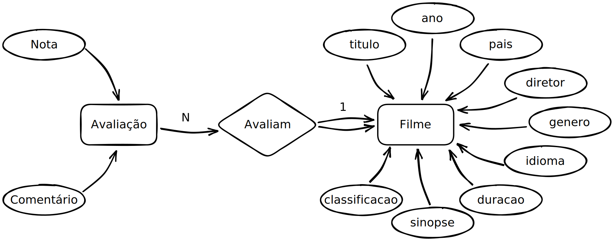

[Maciel Calebe Vidal, Dr](https://www.linkedin.com/in/macielvidal/). Megadados.
[Insper](https://www.insper.edu.br), 2023.

# Mini IMDB

This project uses MySQL as a relational database to store information about movies and their respective ratings. The communication between the database and the application is done through the MySQLAlchemy ORM, which allows for a more intuitive and easy interaction with the database. The application was developed using the FastAPI framework and follows the RESTful architecture, which makes the API easy to use and intuitive for users.

## Database model



## Usage

To use this application, please follow these steps:

1.  Set up your environment and install the required libraries by running the following commands:
    - On Linux/macOS:
        ```sh
        python3 -m venv .venv
        pip install -r requirements.txt
        source ./venv/Scripts/activate
        ```
    - On Windows
        ```ps
        python -m venv .venv
        pip install -r requirements.txt
        .\venv\Scripts\activate
        ```

2.  Create an environment variables file by running one of the following commands, depending on your operating system:
    - On Linux/macOS/PowerShell
        ```sh
        mv .env.example .env
        ```
    - On Windows CMD
        ```cmd
        move .env.example .env
        ```
3.  Fill the `.env` file with the actual acees credentials to your database.

4. Connect [MySQL Workbench](https://www.mysql.com/products/workbench) into the server and run the [`sql/schema.sql`](sql/schema.sql) script to create the `mini_imdb` database.

5. To start the server with auto-reload, run the following command:
    ```sh
    uvicorn src:app --reload
    ```

6. See the docs at [localhost:8000/docs](http://localhost:8000/docs).

## Authors

<table width="100%">
    <tr>
        <td align="center">
            <a href="https://github.com/felipeschiavinato"></a>
        </td>
        <td align="center">
            <a href="https://github.com/FelixLuciano"><br /></a>
        </td>
    </tr>
    <tr>
        <td align="center">
            <a href="https://github.com/felipeschiavinato"><strong>Felipe Schiavinato</strong></a>
        </td>
        <td align="center">
            <a href="https://github.com/FelixLuciano"><strong>Luciano Felix</strong></a>
        </td>
    </tr>
</table>

### Sprint Reports

#### Sprint 1: RESTful API
[Watch the video](https://youtu.be/3wDorhweXe4).

#### Sprint 1: Object-Relational Mapping
[Watch the video](https://youtu.be/3wDorhweXe4).

## License

This code is MIT Licensed! [See the LICENSE file](LICENSE) for details.
